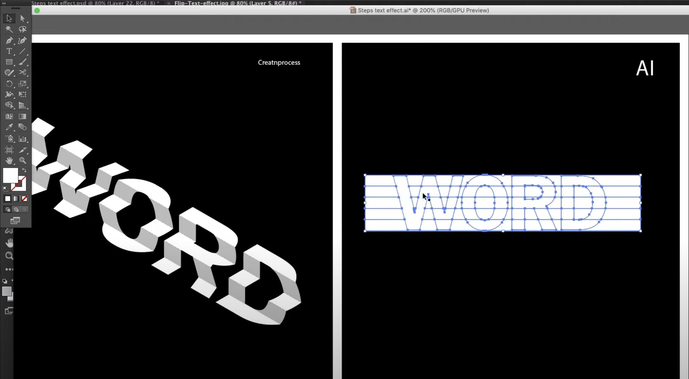

# **Project. BTS**

### *Beautiful Text Stairs*

>

Team 2 : 김병헌 문석영 이본행 장순호

2022.05.23 중간발표


---

# **Contents**

1. 프로젝트 주제 선정
2. 기능 분석 및 설계
3. 적용 기술 및 구현 진행 상황


---

# **1. 프로젝트 주제 선정**

논의 되었던 주제들
- 로딩 인디케이터
- 텍스트 계단 (fabulatorij)
- 마키(Marquee)

---

# **1. 프로젝트 주제 선정**

주제 3안 중에서 만장일치로 [fabulatorij](https://www.fabulatorij.com/) 선정
- 시각적으로 흥미로운 효과
- 스크롤 관련 이펙트
- 적절한 기술적 난이도

<!-- https://www.fabulatorij.com/ -->

---

# **2. 기능 분석 및 설계**

<!--  -->
<!-- https://www.youtube.com/watch?v=vmH8dil_7uI&ab_channel=creatnprocess -->


```html
<div class="stairs_8LJ1-">
    <div class="line_ILzYJ">
        <span class="text_NLT9d" style="transform: translate3d(0px, -87.5079px, 0px);"></span>
        <span class="text_NLT9d" style="transform: translate3d(0px, -87.5079px, 0px);"></span>
        <span class="text_NLT9d" style="transform: translate3d(0px, -87.5079px, 0px);"></span>
```

대략 `stairs` > `line (skew , scale)` > `span (translate)`의 구조 + effect


```css
.line_ILzYJ:nth-child(odd) {
    transform: skew(60deg,-25deg) scaleY(.6667);
}

.line_ILzYJ:nth-child(2n) {
    transform: skew(0deg,-25deg) scaleY(1.33333);
}
```

---

# **2. 기능 분석 및 설계**


<!-- https://www.youtube.com/watch?v=vmH8dil_7uI&ab_channel=creatnprocess -->


```markdown
2 groups (odds/ evens)
1. skew
2. translate
3. scale
```

---

# **2. 기능 분석 및 설계**


<!-- https://www.youtube.com/watch?v=vmH8dil_7uI&ab_channel=creatnprocess -->


```markdown
line 1
    1. AAA

line 2
    1. AAA
    2. BBB

line 3
    1. AAA
    2. BBB
    3. CCC

line 4
    1. AAA
    2. BBB
    3. CCC
    4. DDD
...
```
일러스트에서는 어떻게 만드는가? [youtube](https://www.youtube.com/watch?v=vmH8dil_7uI&ab_channel=creatnprocess)

---


# **3. 적용 기술 및 구현 진행 상황**

- React / ts
- framer-motion
- styled-component


```
# 진행 완료
- 작동 원리 분석 구조 설계 - 

# 진행 중
- 프로토타입 ()

# 진행 예정
- (공동 컨테이터) Framer motion의 Scroll 적용
- (개별 항목) Stair의 hover 이펙트 오케스트레이션
```
---

# 감사합니다
BTS is coming soon ...