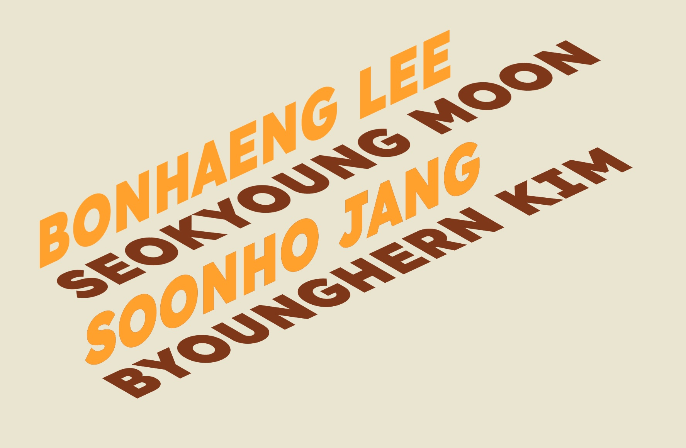

# **Project. BTS**

### *Beautiful Text Stairs*

>

Team 2 : 김병헌 문석영 이본행 장순호

2022.05.23 중간발표


---

# **Contents**

1. 프로젝트 주제 선정
2. 기능 분석 및 설계
3. 적용 기술 및 구현 진행 상황


---

# **1. 프로젝트 주제 선정**

논의 되었던 주제들
- 로딩 인디케이터
- 텍스트 계단 (fabulatorij)
- 마키(Marquee)

---

# **1. 프로젝트 주제 선정**

주제 3안 중에서 만장일치로 [fabulatorij](https://www.fabulatorij.com/) 선정
- 시각적으로 흥미로운 효과
- 스크롤 관련 이펙트
- 적절한 기술적 난이도

<!-- https://www.fabulatorij.com/ -->

---

# **2. 기능 분석 및 설계**

<!--  -->
<!-- https://www.youtube.com/watch?v=vmH8dil_7uI&ab_channel=creatnprocess -->


```html
<div class="stairs_8LJ1-">
    <div class="line_ILzYJ">
        <span class="text_NLT9d" style="transform: translate3d(0px, -87.5079px, 0px);"></span>
        <span class="text_NLT9d" style="transform: translate3d(0px, -87.5079px, 0px);"></span>
        <span class="text_NLT9d" style="transform: translate3d(0px, -87.5079px, 0px);"></span>
```

대략 `stairs` > `line (skew , scale)` > `span (translate)`의 구조 + effect


```css
.line_ILzYJ:nth-child(odd) {
    transform: skew(60deg,-25deg) scaleY(.6667);
}

.line_ILzYJ:nth-child(2n) {
    transform: skew(0deg,-25deg) scaleY(1.33333);
}
```

---

# **2. 기능 분석 및 설계**


<!-- https://www.youtube.com/watch?v=vmH8dil_7uI&ab_channel=creatnprocess -->


```markdown
2 groups (odds/ evens)
1. skew
2. translate
3. scale
```

---

# **2. 기능 분석 및 설계**


<!-- https://www.youtube.com/watch?v=vmH8dil_7uI&ab_channel=creatnprocess -->


```markdown
line 1
    1. AAA
line 2
    1. AAA
    2. BBB
line 3
    1. AAA
    2. BBB
    3. CCC
line 4
    1. AAA
    2. BBB
    3. CCC
    4. DDD
...
```
일러스트에서는 어떻게 만드는가? [youtube](https://www.youtube.com/watch?v=vmH8dil_7uI&ab_channel=creatnprocess)

---


# **3. 적용 기술**

- React / ts
- framer-motion
  - `useViewportScroll`
- styled-component
    - 스트럭처 설계
    ```jsx
    <PageWrapper>
      <Header>
        <PageTitle>BTS</PageTitle>
      </Header>
      <Stair />
    </PageWrapper>
    ```

---

# **3. 구현 내용 (스트럭쳐)**

- App.tsx
    ```jsx
    <PageWrapper>
      <Header>
        <PageTitle>BTS</PageTitle>
      </Header>
      <Stair />
    </PageWrapper>
    ```

---

# **3. 구현 내용 (스트럭쳐)**

- Stairs.tsx
    ```jsx
    <StairSection>
      <StairContainer>

        {stairLines.map(({ emptySpan, filledSpan, whileHover }, i) => (
          <StairLine key={i}>
            {Array.from({ length: emptySpan + filledSpan }).map((_, j) => (
              <motion.span
                key={i + "-" + j}
                transformTemplate={({ y }) => `translateY(-${y})`}
                style={{ y: scroll }}
                whileHover={whileHover}
              >
                {j + 1 > emptySpan ? names[j - emptySpan] : " "}
              </motion.span>
            ))}
          </StairLine>
        ))}
    
      </StairContainer>
    </StairSection>
    ```

---

- Stairs.tsx > StairLine
    ```html
    <StairLine key={i}>

    {Array.from({ length: emptySpan + filledSpan }).map((_, j) => (
        <motion.span                 
            transformTemplate={({ y }) => `translateY(-${y})`}
            style={{ y: scroll }}
            whileHover={whileHover}>
        {names}
        </motion.span>
    ))}

    </StairLine>
    ```

- Stairs.tsx > StairLineProps
    ```ts
    interface StairLineProps {
        emptySpan: number;
        filledSpan: number;
        whileHover?: VariantLabels | TargetAndTransition;
    }
    ```

---


# **3. 구현 내용 (애니메이션)**

- 스크롤 애니메이션 적용
    ```jsx
    const Stair = () => {
        const { scrollYProgress } = useViewportScroll();
        const scroll = useTransform(scrollYProgress, [0, 1], [0.1, MAX_SCROLL_TOP]);

        return ( ... )
    }
    ```

- 반영되는 부분
    ```html
    <motion.span                 
        transformTemplate={({ y }) => `translateY(-${y})`}      // translateY(y)
        style={{ y: scroll }}                                   // y : scroll
        whileHover={whileHover}>
    {names}
    </motion.span>
    ```
---

# **3. 구현 내용 (스크롤 디테일)**

- 스크롤에 따른 `translateY` 로 작동은 하는데, 끊김 현상이 보여요.!
    ```css
    transition: all 0.3s cubic-bezier(0.445, 0.05, 0.55, 0.95);
    ```

- 스크롤을 계속하면 글자가 지구 끝까지 가요, 글자가 계단 끝에 걸쳤으면 좋겠어요.!
    ```js
    const MAX_SCROLL_TOP = 480; // 6rem * 5
    const scroll = useTransform(scrollYProgress, [0, 1], [0.1, MAX_SCROLL_TOP]);
    ```
---

# **3. 구현 내용 (조금 더 디테일)**

- 스크롤을 계속하면 글자가 지구 끝까지 가요, 글자가 계단 끝에 걸쳤으면 좋겠어요.!
    ```js
    const scroll = useTransform(scrollYProgress, [0, 1], [0.1, MAX_SCROLL_TOP]);
    ```
    scrollYProgress 의 변화에 따라,
    - [0 , 1] 까지 변할텐데,
    - [0.1, MAX_SCROLL_TOP] 까지 변화시켜라.! ( = scroll )
---

# **3. 구현 내용 (살짝 공유하는 작은 삽질)**

- 스크롤을 계속하면 글자가 지구 끝까지 가요, 글자가 계단 끝에 걸쳤으면 좋겠어요.!
    ```js
    const { scrollYProgress } = useViewportScroll();
    ```
    scrollYProgress 의 변화에 따라,,,,,, 안바뀌네..?


    컨테이너의 높이를 `100vh` 단위로 지정해서..
    ```js
    const PageWrapper = styled.main`
        height: 100vh;
    `;
    ```
---

# **3. 구현 내용 (개별 애니메이션)**

- 본인 이름 위에 hover할 경우, 실행될 애니메이션은 각자 스타일링.
    ```js
    stairLines.map(({ emptySpan, filledSpan, whileHover }, i) => (
    <motion.span ...
        whileHover={whileHover}      // 자신 이름 영역에 이팩트 적용
    >
    ...
    ```
    
    ```js
    interface StairLineProps {
        emptySpan: number;
        filledSpan: number;
        whileHover?: VariantLabels | TargetAndTransition;
    }
    ```
---


# **3. 구현 내용 (개별 애니메이션)**

- 본인 이름 위에 hover할 경우, 실행될 애니메이션은 각자 스타일링.
    ```css
        whileHover?: VariantLabels | TargetAndTransition;
    ```
    
    ```js
    const stairLines: StairLineProps[] = [
    {
        //본행
        whileHover: {
            filter: "brightness(115%) drop-shadow(-6px -4px 3px #c18214)",
            textShadow: "-6px -4px 3px #ffa412",
        }, ( ... )
    },
    {
        //석영
        whileHover: {
            color: "#ffffff",
            boxShadow: `inset 1000px 0 0 0 #54b3d6`,
        }, ( ... )
    }
    ```
---

# **4. Demo**

---



---


# 감사합니다